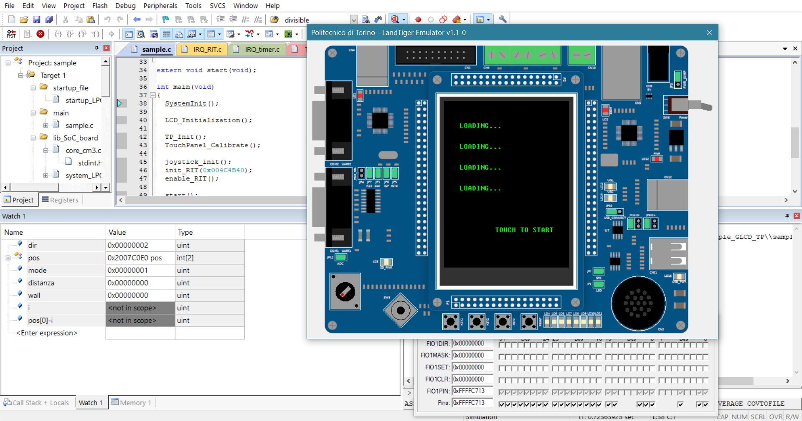
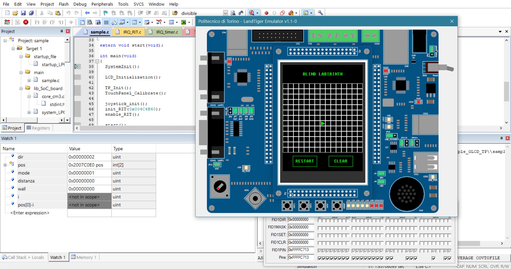
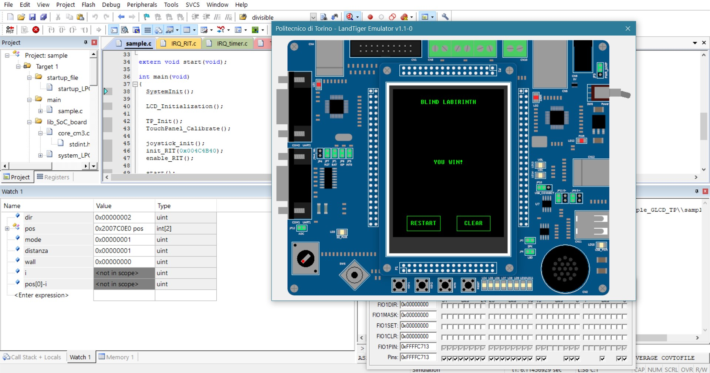

# Extrapoints2
Secondo progetto di Architetture dei sistemi di elaborazione.

## Traccia
Implementare un robot conrollabile tramite controller e fornire un'interfaccia grafica tramite touchscreen (traccia completa [qui](extra_points2_2020.docx)).

## Schermate di gioco

   
  
  Schermata iniziale di gioco. 

  
  

   
   
   
  
  Schermate varie durante il gioco. 

   
  
  Schermata finale di vittoria.

